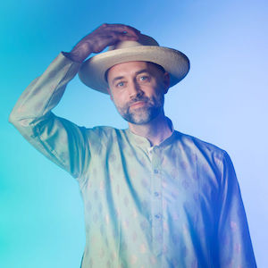

### Hello Friend, fancy meeting you here!

I'm Casen, the creator of this website. I'm a father, software engineer, solver of Rubki's cubes, and spinner of fire. Those are all just labels of course, not what ***I actually am***, but given the limitations of this medium, words and images will have to suffice.

At the time of this writing, my life is full-to-bursting with love and purpose. Bethany and I are raising four enigmatic children; I'm learning more and more about landscaping and forest management, and I'm recovering from my third encounter with COVID. If I've learned anything during my thirty-seven year walkabout on this planet it would be this: *life... uh... finds a way.* 

## How Can I Be of Service?
I suppose you're here for a reason. Perhaps you are a founder of a tech startup looking to get that VC stamp of approval? Maybe you've seen my rather tame, dad-like dance moves at a local ecstatic dance gathering? Whatever the case may be, I'm here for you. This website serves as a gateway into my world.

### Meditation, Yoga and Consciousness
I've been plumbing the depths of my own consciousness since 2018, the year after my father died. My heart has opened into a deeper mystery and I've discovered a depth of compassion I did not know was possible. I'm just now getting my bearings in these practices, and I'd love to share in the journey with you. I'm not a teacher, and I don't offer any professional services, but I do offer my presence and the depth of my being to our shared evolution.

### Startup Engineering
Growing up working class was both a challenge and a privilege. I learned to be entrepreneurial from a young age, and I developed a tremendous amount of grit and determination to succeed. I dove head first into my university education while working part time as a student engineer at Boeing, then moving on to freelance web development in 2008. Being very hands on and very experimental made me a good fit for startups. After I left Boeing, I never set foot in a large company again.

After more than a decade of working in a number of prominent startups that have gone on to IPO, I'm looking to start something of my own. As you can probably tell from this website, I have a certain fondness for the internet as it was in the late '90's, before it was "[...a group of five websites, each consisting of screenshots of text from the other four.](https://twitter.com/tveastman/status/1069674780826071040?lang=en)" The internet has introduced a lot of new opportunities and new challenges for all of us. My hope is to contribute to a future that's more nourishing, more intimate, more joyous and more humaine than the world we find ourselves in today. 
